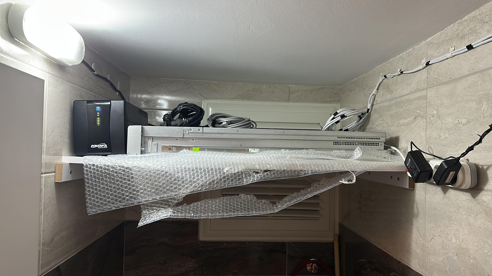
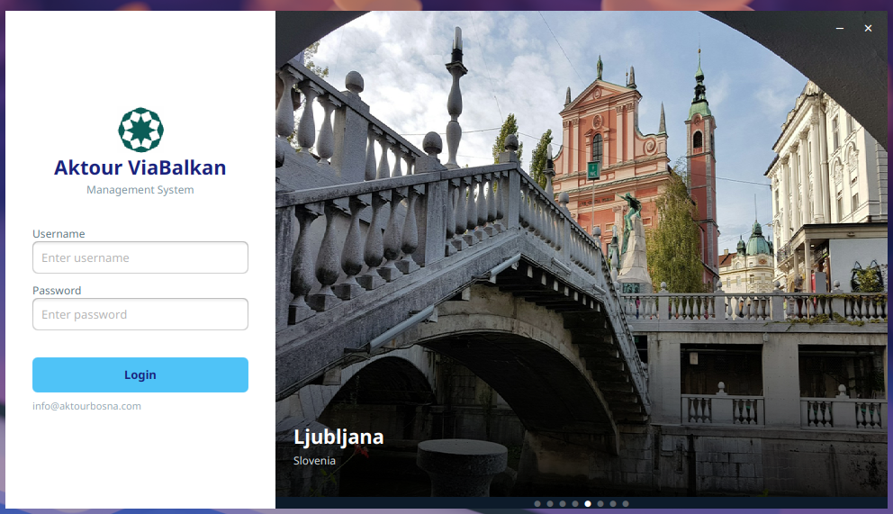
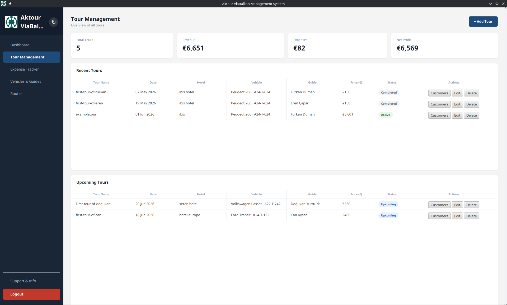
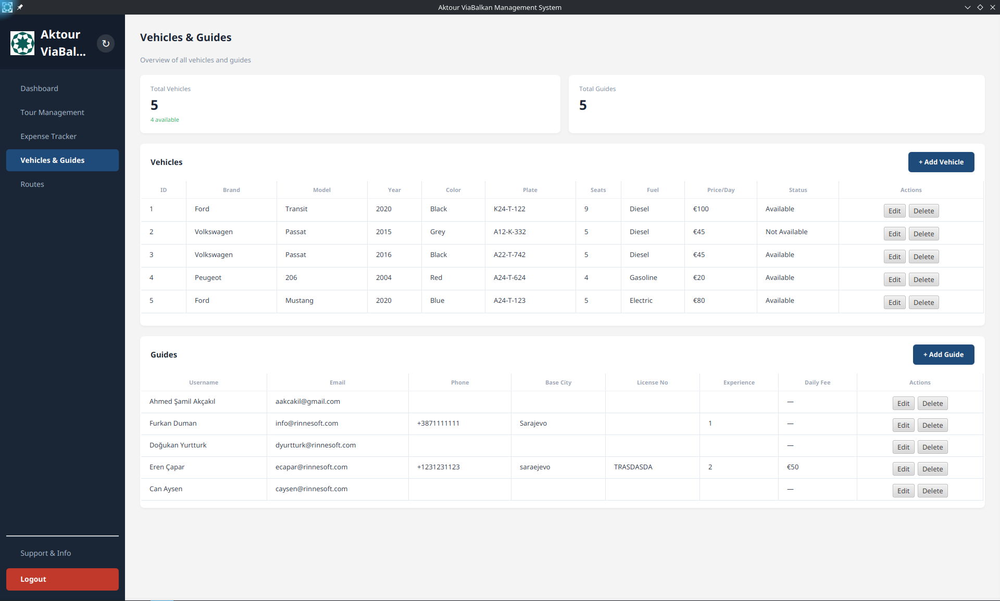
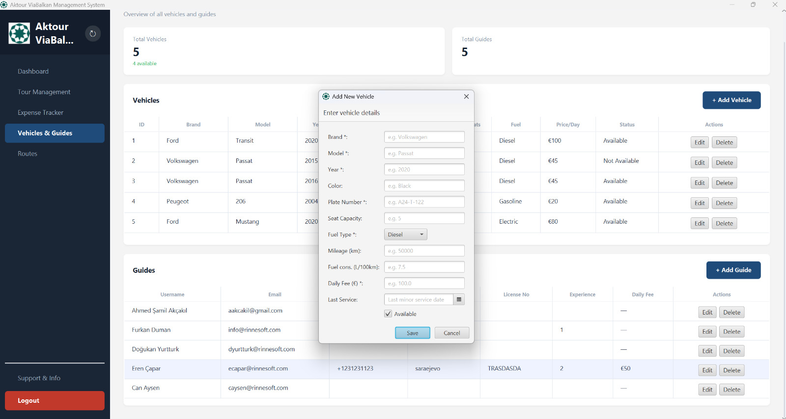
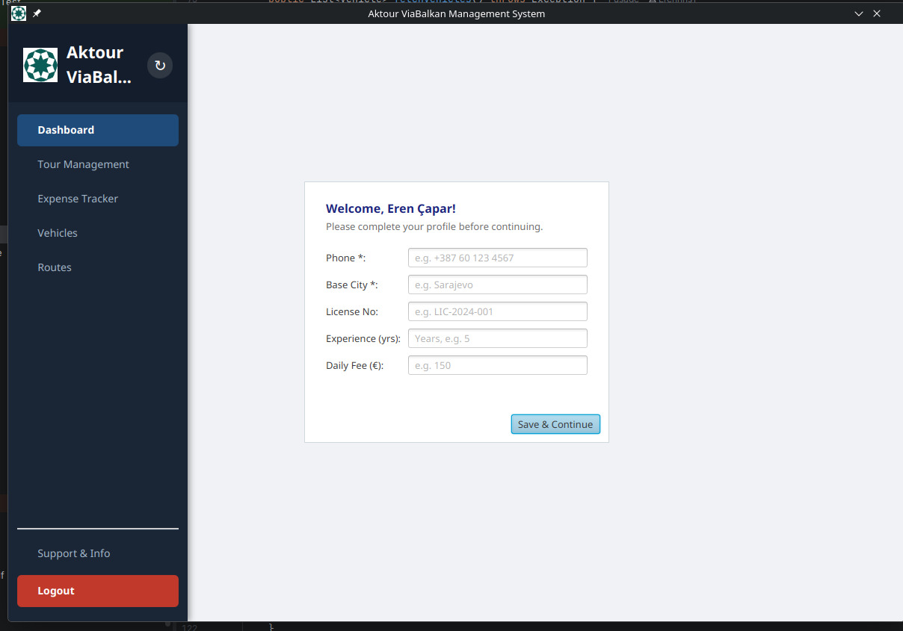
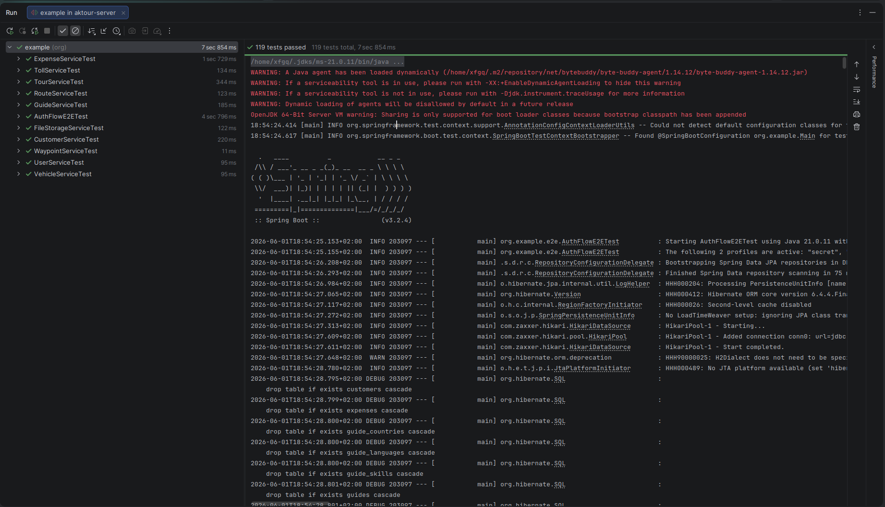

<div align="center">


# Aktour ViaBalkan Management System

**A full-stack desktop management system built for [Aktour](http://aktourbosna.com) — a tour guide company based in Bosnia and Herzegovina, specializing in Balkan region travel.**

[](https://github.com/XFGQ/Aktourbosna-Management-System/actions/workflows/deploy.yml)
[](https://github.com/XFGQ/Aktourbosna-Management-System/actions/workflows/build-installer.yml)


[Live API Docs (Swagger)](http://aktour.rinnesoft.com/swagger) · [Architecture PDF](AktourViaBalkan_Architecture_Design_Documentation.pdf) · [SRS](SRS_AktourViaBalkan.pdf) · [Test Report](AktourViaBalkan_Test-Report.pdf) · [Final Report](Aktour_ViaBalkan_Final_Report.pdf)

</div>

---

## About the Project

Aktour ViaBalkan Management System automates the complex logistics of Balkan tourism operations. Tour managers and guides work from the same platform in real time — managing tours, assigning vehicles, tracking expenses with receipt uploads, and defining routes with waypoints and toll calculations.

The backend runs on **our own physical rack server** housed on-premise, with a **CI/CD pipeline** that automatically builds, tests, and deploys directly to the server on every push to `main`. The desktop client is a cross-platform JavaFX application distributed as `.msi`, `.deb`, or `.rpm` installers.

---

## Features

### Admin Role
| Feature | Description |
|---|---|
| **Dashboard** | Real-time overview: total tours, total revenue (€), active guides, and available vehicles |
| **Tour Management** | Create / edit / delete tours; assign guide, vehicle, hotel, and route; view customers per tour; track status (Active / Upcoming / Completed) |
| **Expense Tracker** | Log per-tour expenses by category with amounts, dates, and receipt file uploads (PDF, PNG, JPEG) |
| **Vehicles & Guides** | Manage the vehicle fleet (brand, model, plate, fuel type, daily fee, availability) and the guide registry |
| **Routes Management** | Define routes with start/end cities, distance, base price, waypoints (drag-to-reorder), and toll entries |
| **User Management** | Create guide accounts and manage credentials |

### Guide Role
| Feature | Description |
|---|---|
| **Profile Setup** | First-login wizard to enter phone, base city, license number, experience, and daily fee |
| **Tour Access** | View assigned tours, manage customers and expenses on their own tours |
| **Read-only Access** | Browse vehicles, routes, and waypoints |

---

## Tech Stack

### Backend (`tur-backend`)
| Technology | Version | Purpose |
|---|---|---|
| Java | 21 | Language |
| Spring Boot | 3.2.4 | Application framework |
| Spring Security | – | JWT-based stateless authentication |
| Spring Data JPA | – | ORM / database access |
| MariaDB / MySQL | 11.8 | Production database |
| H2 | – | In-memory database for CI tests |
| SpringDoc OpenAPI | 2.2.0 | Swagger UI generation |
| Lombok | 1.18.38 | Boilerplate reduction |
| MapStruct | 1.5.5 | DTO ↔ Entity mapping |
| JJWT | 0.12.5 | JWT token creation & validation |

### Frontend (`tur-frontend`)
| Technology | Version | Purpose |
|---|---|---|
| Java | 21 | Language |
| JavaFX | 21.0.2 | Desktop UI framework |
| Gson | 2.10.1 | JSON serialization for API calls |
| Lombok | 1.18.38 | Boilerplate reduction |

### Infrastructure & DevOps
| Tool | Purpose |
|---|---|
| GitHub Actions | CI/CD — build, test, and deploy on every push to `main` |
| `jpackage` | Produces `.msi` (Windows), `.deb` (Debian/Ubuntu), `.rpm` (Fedora/RHEL) installers |
| Cisco UCS Rack Server | Physical on-premise server hosting the backend |
| Debian Linux 6.12.85 | Server OS |
| `systemd` | Manages the `aktour-backend` service |

---

## Physical Server Infrastructure

The backend is self-hosted on a **physical Cisco UCS rack server** with a UPS unit for power protection. The database runs **MariaDB 11.8.6** on Debian GNU/Linux. No cloud provider — owned and operated hardware.

<table>
  <tr>
    <td align="center"><b>Rack Installation (UPS + Server)</b></td>
    <td align="center"><b>Cisco UCS Hardware (open chassis)</b></td>
  </tr>
  <tr>
    <td></td>
    <td></td>
  </tr>
</table>

**Live Swagger UI:** [http://aktour.rinnesoft.com/swagger](http://aktour.rinnesoft.com/swagger)

Database tables running on the production server:

```
customers · expenses · guides · guide_countries · guide_languages · guide_skills
routes · route_tolls · route_waypoints_mapping · tolls · tour_extra_waypoints
tours · users · vehicles · vehicle_service_history · waypoints
```


---

## Getting Started

### Prerequisites

- **Java 21** (Temurin recommended)
- **Maven 3.8+**
- **MariaDB or MySQL** running locally

### 1. Configure the Backend

Copy the example secrets file and fill in your values:

```bash
cp tur-backend/src/main/resources/application-secret.properties.example \
   tur-backend/src/main/resources/application-secret.properties
```

Edit `application-secret.properties`:

```properties
spring.datasource.url=jdbc:mysql://localhost:3306/aktour_db?serverTimezone=UTC
spring.datasource.username=your_db_user
spring.datasource.password=your_db_password

admin1.username=admin
admin1.password=your_admin_password
admin1.email=admin@aktourbosna.com

jwt.secret=your_very_long_random_jwt_secret_key_here
jwt.expiration=86400000
```

Create the database:

```sql
CREATE DATABASE aktour_db CHARACTER SET utf8mb4 COLLATE utf8mb4_unicode_ci;
```

### 2. Run the Backend

```bash
cd tur-backend
mvn spring-boot:run
```

The server starts on **`http://localhost:8080`**.  
Verify: `http://localhost:8080/api/tours`  
Swagger UI: `http://localhost:8080/swagger`

On startup, admin accounts defined in `application-secret.properties` are automatically seeded into the database if they do not already exist.

### 3. Run the Frontend

> **Important:** Run `MainLauncher`, **not** `Main.java`. `MainLauncher` works around a JavaFX module-path issue when launching from the IDE.

```bash
cd tur-frontend
mvn javafx:run
```

Or from your IDE: run `org.example.MainLauncher`.

---

## Running Tests

```bash
cd tur-backend
mvn test
```

Tests use an **H2 in-memory database** — no MariaDB instance required. The suite covers:

- `CustomerServiceTest` · `ExpenseServiceTest` · `FileStorageServiceTest`
- `GuideServiceTest` · `RouteServiceTest` · `TollServiceTest`
- `TourServiceTest` · `UserServiceTest` · `VehicleServiceTest` · `WaypointServiceTest`
- `AuthFlowE2ETest` — end-to-end authentication flow

---

## Building Installers

Installers are built automatically by GitHub Actions when a tag matching `v*` is pushed, or can be triggered manually via `workflow_dispatch`.

| Platform | Format | Maven Profile |
|---|---|---|
| Windows | `.msi` | `-Pwindows` |
| Debian / Ubuntu | `.deb` | `-Plinux` |
| Fedora / RHEL | `.rpm` | `-Plinux` |

Built installers are attached to GitHub Releases automatically.

---

## CI/CD Pipeline

```
Push to main branch
        │
        ▼
┌──────────────────────────────┐
│  build-and-test              │
│  • Spin up MariaDB in CI     │
│  • mvn clean package         │
│  • Run full test suite       │
└──────────────┬───────────────┘
               │ (only on push, not PR)
               ▼
┌──────────────────────────────┐
│  deploy                      │
│  • SCP JAR → rack server     │
│  • SSH: systemctl restart    │
│    aktour-backend            │
└──────────────────────────────┘
```

Pull requests must pass the full test suite before they can be merged into `main`.

---

## API Endpoints

Full interactive documentation is available at [http://aktour.rinnesoft.com/swagger](http://aktour.rinnesoft.com/swagger).

| Method | Endpoint | Auth | Description |
|---|---|---|---|
| `POST` | `/api/auth/login` | Public | Login, returns JWT token |
| `GET/POST/PUT/DELETE` | `/api/tours/**` | ADMIN, GUIDE | Tour CRUD |
| `GET/POST/PUT/DELETE` | `/api/tours/{id}/expenses/**` | ADMIN, GUIDE | Expense management |
| `POST` | `/api/tours/{id}/expenses/{id}/receipt` | ADMIN, GUIDE | Upload receipt file |
| `GET` | `/api/tours/{id}/expenses/{id}/receipt` | ADMIN, GUIDE | Download receipt file |
| `GET/POST/PUT/DELETE` | `/api/guides/**` | ADMIN (mutations), GUIDE (read + self-edit) | Guide management |
| `GET/POST/PUT/DELETE` | `/api/vehicles/**` | ADMIN (mutations), GUIDE (read) | Vehicle management |
| `GET/POST/PUT/DELETE` | `/api/routes/**` | ADMIN (mutations), GUIDE (read) | Route management |
| `GET/POST/PUT/DELETE` | `/api/waypoints/**` | ADMIN (mutations), GUIDE (read) | Waypoint management |
| `GET/POST/PUT/DELETE` | `/api/users/**` | ADMIN only | User management |

---

## Project Documentation

| Document | Description |
|---|---|
| [`SRS_AktourViaBalkan.pdf`](SRS_AktourViaBalkan.pdf) | Software Requirements Specification |
| [`AktourViaBalkan_Architecture_Design_Documentation.pdf`](AktourViaBalkan_Architecture_Design_Documentation.pdf) | Architecture & design decisions |
| [`Updated_AktourViaBalkan_UML_Diagrams.pdf`](Updated_AktourViaBalkan_UML_Diagrams.pdf) | UML class, sequence, and use-case diagrams |
| [`AktourViaBalkan_Test-Report.pdf`](AktourViaBalkan_Test-Report.pdf) | Test case results and coverage report |
| [`Aktour_ViaBalkan_Final_Report.pdf`](Aktour_ViaBalkan_Final_Report.pdf) | Complete project final report |
| [`CS308_V2.pdf`](CS308_V2.pdf) | CS308 project proposal |

---

## Screenshots

### Login Screen


---

### Dashboard


---

### Tour Management


---

### Vehicles & Guides


---

### Add New Vehicle


---

### Guide Profile Setup (First Login)


---

### Expense Tracker


---

### Routes Management


---

### Test Cases


---

## Team

This project was developed as part of the **CS308 Software Engineering** course.

| Name | Role | GitHub |
|---|---|---|
| **Hasan Talha Akçakıl** | Product Owner | — |
| **Furkan Duman** | Developer | [@XFGQ](https://github.com/XFGQ) |
| **Doğukan Yurtturk** | Developer | [@Dgkann](https://github.com/Dgkann) |
| **Can Aysen** | Developer | [@Canaisen](https://github.com/Canaisen) |
| **Eren Çapar** | Developer | [@Erennns1](https://github.com/Erennns1) |

---

<div align="center">
<sub>Built with Java 21 · Spring Boot · JavaFX · MariaDB · Deployed on our own physical rack server</sub>
</div>
